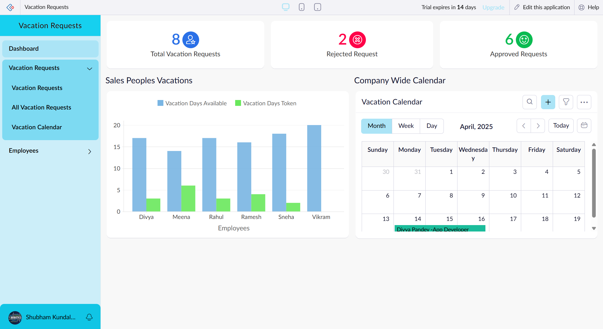
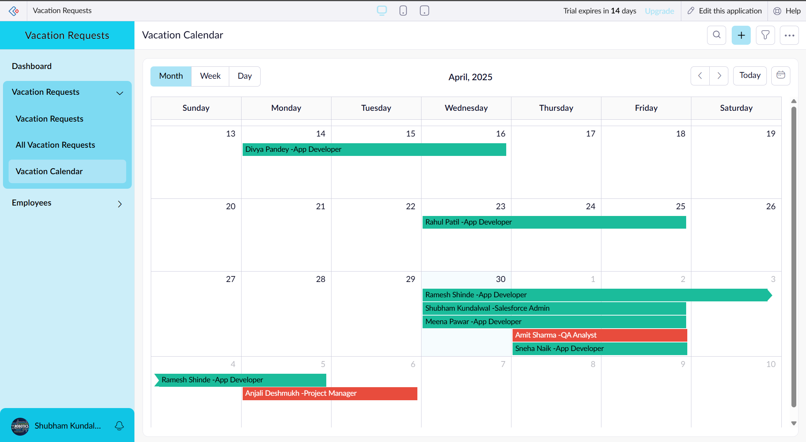
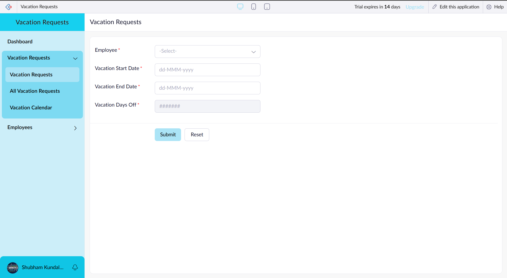
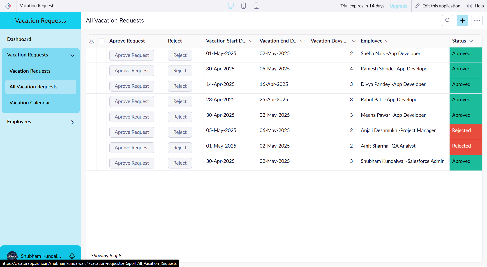
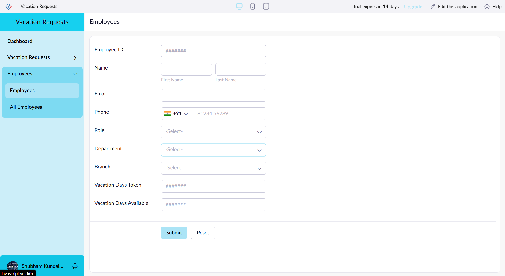
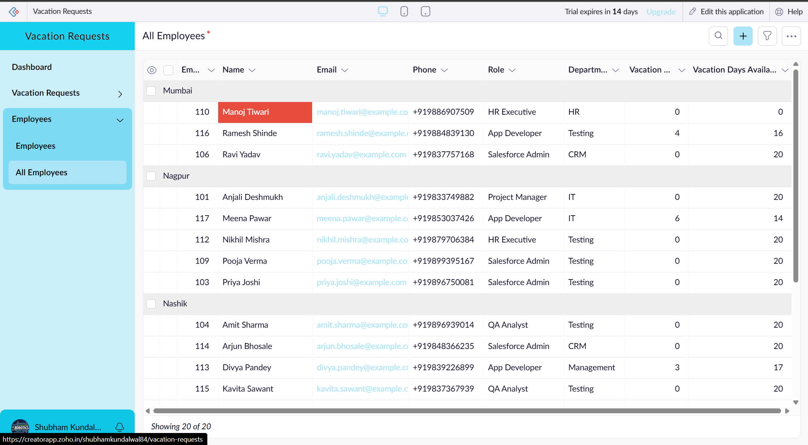

# Vacation Request Management System (Zoho Creator)

A low-code application built using Zoho Creator to manage employee vacation requests with admin approval workflows.

## 🌟 Features
- Employee Form for vacation requests
- Admin approval/rejection functionality
- Auto email alerts using Deluge script
- Dashboard with vacation stats
- Role-based access control

## 🔧 Tech Stack
- Zoho Creator (Low-Code Platform)
- Deluge Script (Zoho’s scripting language)

## 📷 Screenshots Of Desktop App

## 📷 Screenshots Of Desktop App

## 📁 Files
- Form Designs
- Workflow Scripts
- Sample Data
